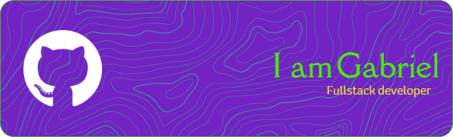

## :rocket: About me:   :rocket: Über mich:

I'm a Graphic Designer, I've been working with photo restoration for 8 years and Graphic Design for 3 years.
I have always been passionate about technology and started studying programming in depth in 2023.
I'm looking for learning and great opportunities!

Ich bin Grafikdesigner und beschäftige mich seit 8 Jahren mit der Fotorestaurierung und seit 3 ​​Jahren mit Grafikdesign.
Ich hatte schon immer eine Leidenschaft für Technik und habe 2023 begonnen, mich intensiv mit Programmierung zu befassen.
Ich bin auf der Suche nach Lernen und tollen Möglichkeiten!

## :memo: Contact:   :memo: Kontakt:

  

## :bar_chart: Statistics   :bar_chart: Statistiken

 

## :mortar_board: Skills:   :mortar_board: Fähigkeiten:

### :heavy_check_mark: Markup and style languages:   :heavy_check_mark: Auszeichnungs- und Stilsprachen:

### :heavy_check_mark: Programming languages:   :heavy_check_mark: Programmierung Sprachen:

### :heavy_check_mark: Tools:   :heavy_check_mark: Werkzeuge:

 

### :heavy_check_mark: OS:

## :books: I am studying:   :books: Ich studiere:

### :chart_with_upwards_trend: Programming languages:   :chart_with_upwards_trend: Programmierung Sprachen:

### :chart_with_upwards_trend: Libraries and Frameworks:   :chart_with_upwards_trend: Bibliotheken und Frameworks:

### :chart_with_upwards_trend: Database:   :chart_with_upwards_trend: Datenbank:

### :chart_with_upwards_trend: Tools:   :chart_with_upwards_trend: Werkzeuge:

### :toolbox: Studying at:   :toolbox: Studiert bei:

- 
- 
- 

## :construction: Projects I'm working on: :construction:   :construction: Projekte an denen ich arbeite: :construction:

:warning: I'm not working on anything special at the moment but there will be some here soon. :warning:

:warning: Im Moment arbeite ich an nichts Besonderem, aber es wird bald einiges hier geben. :warning:

## :art: Extra:

I have skills acquired throughout my Design career that can be useful in my work as a developer, such as:  
Ich habe mir im Laufe meiner Designkarriere Fähigkeiten angeeignet, die mir bei meiner Arbeit als Entwickler nützlich sein können, wie zum Beispiel:

<!--
**gxbxD/gxbxD** is a ✨ _special_ ✨ repository because its `README.md` (this file) appears on your GitHub profile.

Here are some ideas to get you started:

- 🔭 I’m currently working on ...
- 🌱 I’m currently learning ...
- 👯 I’m looking to collaborate on ...
- 🤔 I’m looking for help with ...
- 💬 Ask me about ...
- 📫 How to reach me: ...
- 😄 Pronouns: ...
- ⚡ Fun fact: ...
-->
